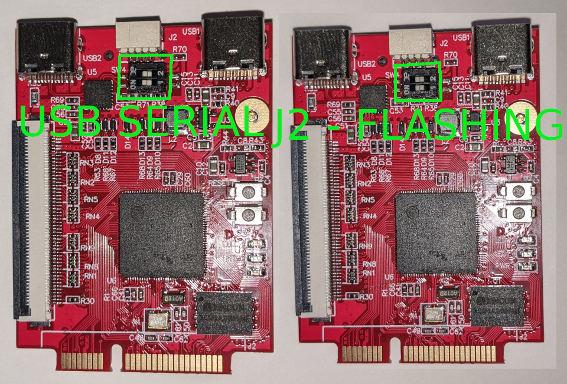

# DongShanPi One


## Specs

- SigmaStar SSD202D
- 0.9/1.0V core voltage control
- JST SH 4p connector for PM_UART/ISP
- USB-C host port (usb1)
- CP2104 usb->serial (usb2)
- Micro SD card slot
- XCSP1AAWH-NT 128MB SPI NAND flash
- 1 x GPIO button
- 2 x GPIO controlled LEDs (third LED is power)
- RGB LCD connector
- Mini PCIe format connector (NOT ACTUALLY PCIe!!)

## Building u-boot

- Clone https://github.com/linux-chenxing/u-boot.git
- Check out `mstar_rebase_mainline_20211217`
- run `make mstar_infinity2m_dongshanpione_defconfig`
- run `make CROSS_COMPILE=arm-linux-gnueabi-`

## Flashing

### Dip switches

PM_UART must be connected to J2 via the dip switches.
The dip switches should be in the off position.



## Make sure nothing is handling PM_UART

If u-boot or Linux are running and responding to data on PM_UART it'll mess with flashing.

### Flashing with SNANDer

With an i2c dongle and the mstar enabled SNANDer fork:

First erase the flash.

```
sudo ./SNANDer -p mstarddc -c /dev/i2c-4:49 -e
```

Example output, some erase failures are probably OK. These are probably the premarked bad blocks.

```
daniel@shiro:/media/junk/coding/SNANDer/src$ sudo ./SNANDer -p mstarddc -c /dev/i2c-4:49 -e
[sudo] password for daniel: 

SNANDer - Serial Nor/nAND/Eeprom programmeR v.1.7.2 by McMCC <mcmcc@mail.ru>

connection /dev/i2c-4:49
Info: Will try to use device /dev/i2c-4 and address 0x49.
Info: Will NOT reset the device at the end.
here xx1
here xx2
spi_nand_probe: mfr_id = 0x9c, dev_id = 0x1
Get Status Register 1: 0x00
Get Status Register 2: 0x10
Using Flash ECC.
Detected SPI NAND Flash: XINCUN XCSP1AAWH-NT, Flash Size: 128 MB
ERASE:
Set full erase chip!
Erase addr = 0x0000000000000000, len = 0x0000000008000000
spi_nand_erase_block : erase block fail, block = 0x200, status = 0x4
spi_nand_erase_internal : Erase Fail at addr = 0x4000000, len = 0x8000000, block_idx = 0x200
spi_nand_erase_block : erase block fail, block = 0x201, status = 0x4
spi_nand_erase_internal : Erase Fail at addr = 0x4020000, len = 0x8000000, block_idx = 0x201
spi_nand_erase_block : erase block fail, block = 0x203, status = 0x4
spi_nand_erase_internal : Erase Fail at addr = 0x4060000, len = 0x8000000, block_idx = 0x203
spi_nand_erase_block : erase block fail, block = 0x300, status = 0x4
spi_nand_erase_internal : Erase Fail at addr = 0x6000000, len = 0x8000000, block_idx = 0x300
spi_nand_erase_block : erase block fail, block = 0x3ff, status = 0x4
spi_nand_erase_internal : Erase Fail at addr = 0x7fe0000, len = 0x8000000, block_idx = 0x3ff
Erase 100% [134217728] of [134217728] bytes      
Status: BAD(-1)
```

Next write the GCIS.bin

```
sudo ./SNANDer -p mstarddc -c /dev/i2c-4:49 -w GCIS.bin
```

Example output:

```
daniel@shiro:/media/junk/coding/SNANDer/src$ sudo ./SNANDer -p mstarddc -c /dev/i2c-4:49 -w ~/win7vmshare/ISP_5.0.18/boot/GCIS.bin 

SNANDer - Serial Nor/nAND/Eeprom programmeR v.1.7.2 by McMCC <mcmcc@mail.ru>

connection /dev/i2c-4:49
Info: Will try to use device /dev/i2c-4 and address 0x49.
Info: Will NOT reset the device at the end.
here xx1
here xx2
spi_nand_probe: mfr_id = 0x9c, dev_id = 0x1
Get Status Register 1: 0x00
Get Status Register 2: 0x11
Using Flash ECC.
Detected SPI NAND Flash: XINCUN XCSP1AAWH-NT, Flash Size: 128 MB
WRITE:
Write addr = 0x0000000000000000, len = 0x0000000000000800
Written 100% [2048] of [2048] bytes      
Elapsed time: 2 seconds
Status: OK
```

Next write the vendor IPL.bin:

```
sudo ./SNANDer -p mstarddc -c /dev/i2c-4:49 -a 0x140000 -l <file len in hex> -w IPL.bin
```

example output:

```
daniel@shiro:/media/junk/coding/SNANDer/src$ sudo ./SNANDer -p mstarddc -c /dev/i2c-4:49 -a 0x140000 -l 0x54C0 -w ~/win7vmshare/ISP_5.0.18/boot/IPL.bin 

SNANDer - Serial Nor/nAND/Eeprom programmeR v.1.7.2 by McMCC <mcmcc@mail.ru>

connection /dev/i2c-4:49
Info: Will try to use device /dev/i2c-4 and address 0x49.
Info: Will NOT reset the device at the end.
here xx1
here xx2
spi_nand_probe: mfr_id = 0x9c, dev_id = 0x1
Get Status Register 1: 0x00
Get Status Register 2: 0x11
Using Flash ECC.
Detected SPI NAND Flash: XINCUN XCSP1AAWH-NT, Flash Size: 128 MB
WRITE:
Write addr = 0x0000000000140000, len = 0x00000000000054C0
Written 100% [21696] of [21696] bytes      
Elapsed time: 13 seconds
Status: OK
```

Next we write the u-boot SPL in the ipl cust spot.

```
sudo ./SNANDer -p mstarddc -c /dev/i2c-4:49 -a 0x200000 -l <file len in hex> -w u-boot/ipl
```

example output

```
daniel@shiro:/media/junk/coding/SNANDer/src$ sudo ./SNANDer -p mstarddc -c /dev/i2c-4:49 -a 0x200000 -l 0x8B00 -w ~/coding/breadbee/breadbee_dev/u-boot/ipl 

SNANDer - Serial Nor/nAND/Eeprom programmeR v.1.7.2 by McMCC <mcmcc@mail.ru>

connection /dev/i2c-4:49
Info: Will try to use device /dev/i2c-4 and address 0x49.
Info: Will NOT reset the device at the end.
here xx1
here xx2
spi_nand_probe: mfr_id = 0x9c, dev_id = 0x1
Get Status Register 1: 0x00
Get Status Register 2: 0x11
Using Flash ECC.
Detected SPI NAND Flash: XINCUN XCSP1AAWH-NT, Flash Size: 128 MB
WRITE:
Write addr = 0x0000000000200000, len = 0x0000000000008B00
Written 100% [35584] of [35584] bytes      
Elapsed time: 21 seconds
Status: OK
```


### Updating with SNANDer

```
sudo ./SNANDer -p mstarddc -c /dev/i2c-4:49 -a 0x200000 -l 0x20000 -e
sudo ./SNANDer -p mstarddc -c /dev/i2c-4:49 -a 0x200000 -l <size> -w <path>
```

## Working USB devices

- WAVLINK WL-NWU327GC - USB-C gigabit ethernet 
  - [amazon.jp](https://www.amazon.co.jp/WAVLINK-%E6%9C%89%E7%B7%9ALAN%E3%82%A2%E3%83%80%E3%83%97%E3%82%BF%E3%83%BC-%E3%82%AE%E3%82%AC%E3%83%93%E3%83%83%E3%83%88%E3%82%A4%E3%83%BC%E3%82%B5%E3%83%8D%E3%83%83%E3%83%88%E5%A4%89%E6%8F%9B%E3%82%A2%E3%83%80%E3%83%97%E3%82%BF%E3%83%BC-1000Mbps-11-X%E3%80%81Linux%E3%80%81Chrome/dp/B09FFK844R)
  - [banggood](https://usa.banggood.com/WAVLINK-USB-3_1-Type-C-or-USB3_0-to-Gigabit-Ethernet-Adapter-USB3_0-to-LAN-RJ45-Port-Converter-5Gbps-Network-Connector-p-1910699.html?cur_warehouse=CN&ID=529723)

## More images

### Red version


### Red version - back


